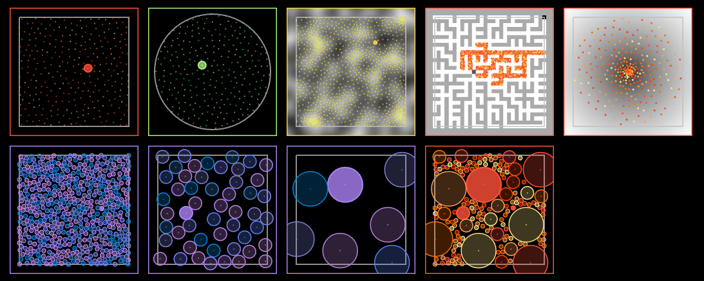

# UniformPoissonDisk
Uniform Poisson Disk Sampling (WIP).

[online js demo](https://cdn.rawgit.com/azrafe7/UniformPoissonDisk/master/bin/JsDemo/index.html)
 

Sampling rects and circles is already available. 
Next step is adding the possibility to customize the function used to reject/include a sample in the final result.

## References

 - http://devmag.org.za/2009/05/03/poisson-disk-sampling/ (read this!)
 - http://theinstructionlimit.com/fast-uniform-poisson-disk-sampling-in-c (by Renaud Bédard)

The algorithm is from the "Fast Poisson Disk Sampling in Arbitrary Dimensions" paper by Robert Bridson
 - http://www.cs.ubc.ca/~rbridson/docs/bridson-siggraph07-poissondisk.pdf
